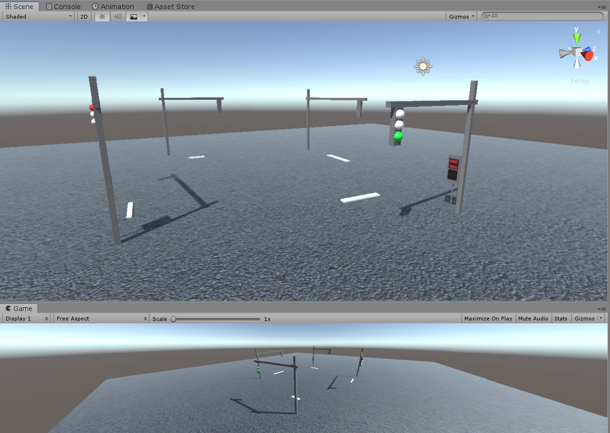
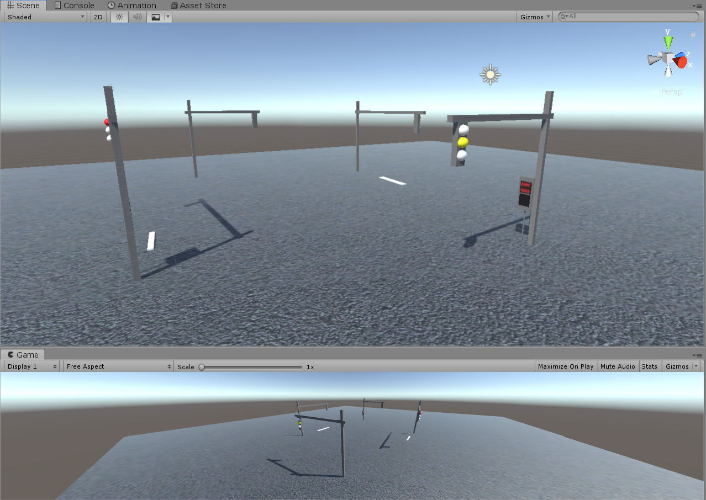
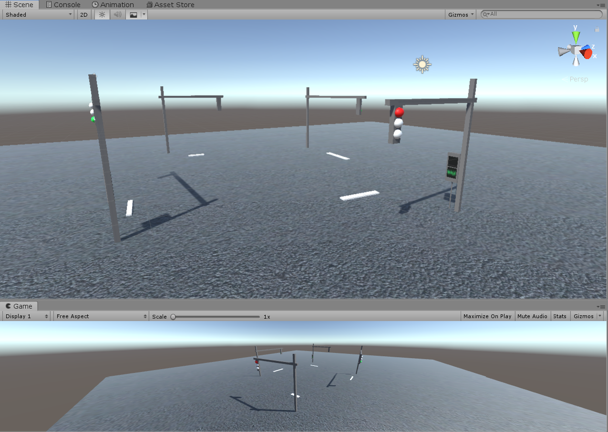

# Unity-Traffic-Light-System
 A Unity Traffic Light System with Pedestrian Signal
 
 
 
 

 The light time is adjustable, and can be used for stopping cars.
 To control the interaction with cars, use the box collider under the green and red light object. Turn on the collider to physically block cars or set the colllider to be trigger and use on trigger enter to control cars.
